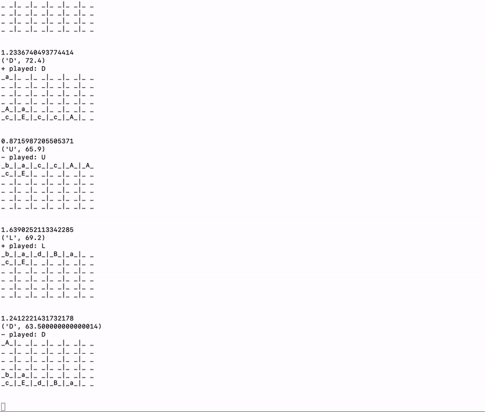

# IJK Game

IJK is a simple game that makes use of the Minimax and the Minimax with alpha beta pruning
algorithms. The game is demonstrated below,

## Introduction

IJK is a sliding game played on a 6x6 grid by two players - **uppercase** and **lowercase.**
The uppercase player starts. The goal of the game is to reach the letter 'K', for
uppercase and 'k' for the lowercase player start from 'A' and 'a' respectively. Each
player is allowed 4 moves - up, down, left, right. A letter can collide with each other
only if they are the same letter, irrespective of the case. If same letters of the different
cases are merged, then the case of the resulting letter is the either upper or lower
depending on the player that merged the two letters. The game continues till a player
has reached the goal letter or there are no more empty blocks in the game or the
maximum umber of moves is reached.

The game consists of 2 mode - deterministic and non-deterministic. Based on the mode
of the game different algorithms are used. For the deterministic approach, the
minimax with alpha beta pruning is used. Whereas, for the non-deterministic mode
the normal minimax algorithm is used. This is due to the addition of chance nodes,
as bounds for a tree cannot be determined if there are chance nodes. Hence, the
non-deterministic mode cannot make use of the optimisation provided by alpha beta
pruning.

## Minimax Algorithm

This is a recursive algorithm has 2 players, maximizing and minimizing, in our case
uppercase (+) and lowercase (-). Both the players alternate their turns, with the
uppercase moving first. The algorithm starts of by checking the termination conditions,
- if maximum depth has been reached
- if the game is full
- if the game has been won by either of the players
- if the time for the move exceeds 3 seconds

If any of these conditions occur, then the recursion returns with the best move
(U, L, D, R) of the node and the evaluation function. This algorithm is used
when the game move is **non-deterministic.** The chance node is evaluated with the
probability = 1 / number of empty blocks. This probability is the multiplied by the
value returned by the evaluation function. The best value for every depth is
continuously updated and propagated upwards.

## Minimax with alpha-beta pruning Algorithm

This recursive algorithm also follows a similar approach as stated in the minimax
algorithm above. But this is used when the game mode is **deterministic**.
The values of alpha and beta are constantly updated so that the full tree does
not need to be searched, hence optimising it. This causes the increase of the
depth of the search tree significantly, as compared to the normal minimax algorithm.

## Evaluation Functions

Below are the evaluation function used

### 1. Max Merges
**Function:** `__max_merge_heuristic(mat, player)`

This function calculates the total number merges possible for a game configuration
for the player, hence the potential swipes from the current state to next state
that has letters closer to the goal. A game configuration that has more merge-able
letters is more promising than a game that has can only slide.

### 2. Smoothness
**Function:** `__smoothness_heuristic(mat)`

The function calculates something called the 'smoothness' value of the game. For
each letter, it calculates if it is within 1 manhattan distance away from its
merge-able letter. For each configuration, the algorithm will pick the sum of the
move that minimizes the cost of the distances. A good intuition behind this is that
the game can progress only when there are merge-able letters adjacent to each other.
Therefore, the algorithm should try to minimize the total weight. At some point,
there will always be letters that are close to the goal state, and therefore, the
algorithm should try to keep these values close to each other to increase the chance
of possible merges.

### 3. Number of empty blocks
**Function:** `__empty_blocks(mat)`

The function calculates the number of empty blocks. The best situation is when the
number of empty blocks are higher, and the worst being the game configuration when
the game has non more empty blocks. Therefore, the number of empty blocks sort of
gives a reward/penalty for a given game configuration.

## How to run?

Below are the instructions as to how to get it run on your Terminal/Command Prompt.

1. Install Python3. (can be found [here](https://www.python.org/downloads/))
2. Clone the repo
3. `cd IJK-Game`
4. `./IJK.py player1 player2 mode`
 * **player options**: ai, human
 * **mode options**: det, nondet
 * **example**: `./IJK.py ai human det`

## Future Enhancements

With the basic functionality of the game being ready, some future enhancements are planned for the project.
1. **Create an interactive UI for the game:** At the moment, the game can only be played through the terminal or a command prompt, and the user has to type in the move (L, D, U, R). To take this game to the next level would be to add an interface to it (python standalone app/ web app/ mobile app) so that the user can use the arrow keys or maybe even slide it to play the game.

2. **Better evaluation functions:** With the current heuristics, the algorithm can explore the game tree upto a depth of 9. Thereby, having better heuristic functions, the depth of the tree to be explored could be increased so as to give a more accurate prediction by the AI.

## References
1. https://news.ycombinator.com/item?id=7381082
2. http://cs229.stanford.edu/proj2016/report/NieHouAn-AIPlays2048-report.pdf
3. http://blog.datumbox.com/using-artificial-intelligence-to-solve-the-2048-game-java-code/
4. http://artent.net/2014/04/07/an-ai-for-2048-part-4-evaluation-functions/
